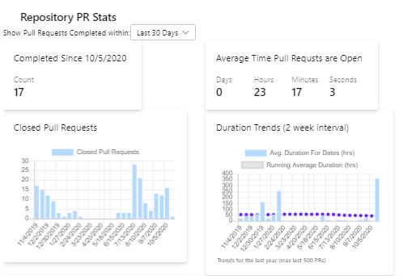
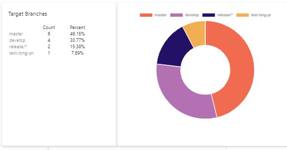
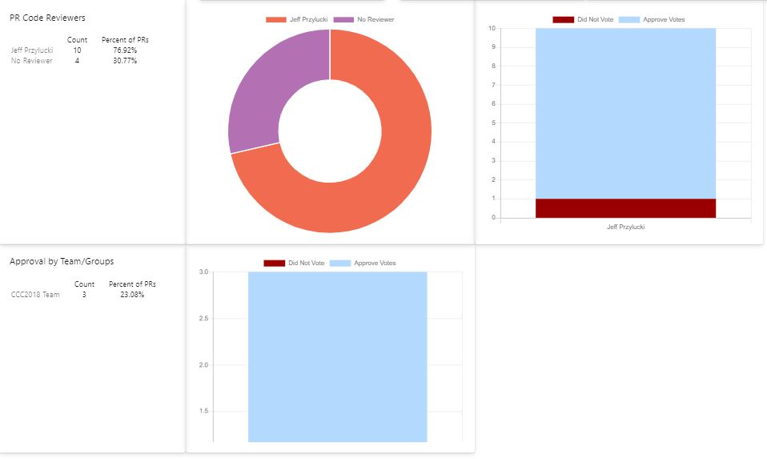

# Azure DevOps Pull Request Stats

This Extension to Azure DevOps will give you a new Hub in your repositories section that is aimed at providing some statistical insights in to your Pull Request process.  This will show you things like the average time a PR is open, and show trends over time.  It will show you what branches are getting pull requests created for.  It will show you who is approving the Pull Requests, and what their voting trends are.  It will also show you what Groups have been assigned as reviewers of the Pull Requests are, and show you their voting history on the Pull Requests for your repository.

## Images

## Source
[GitHub](https://github.com/jeffpriz/devops-pr-stats)

## Issues
[File an issue](https://github.com/jeffpriz/devops-pr-stats/issues)

## Credits
[Jeff Przylucki](http://www.oneluckidev.com)